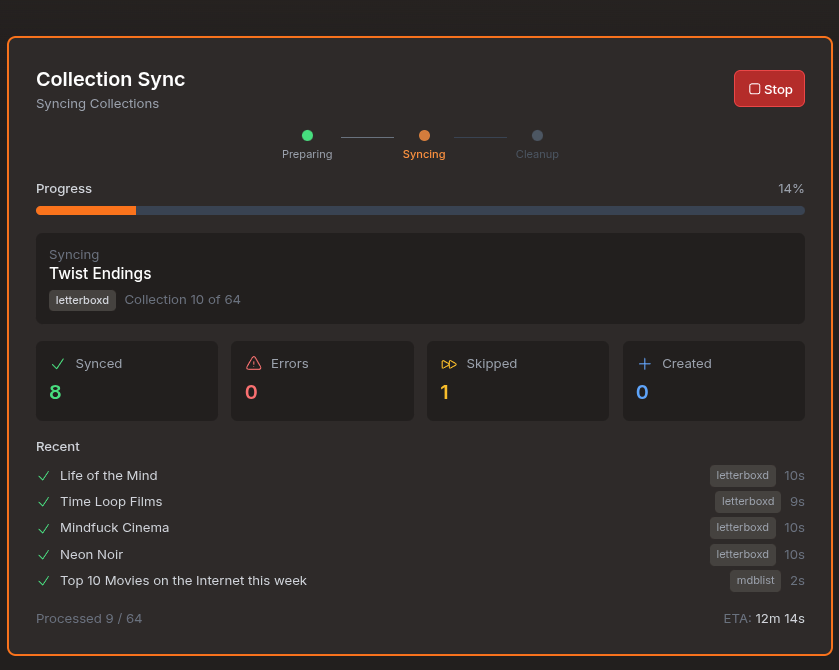
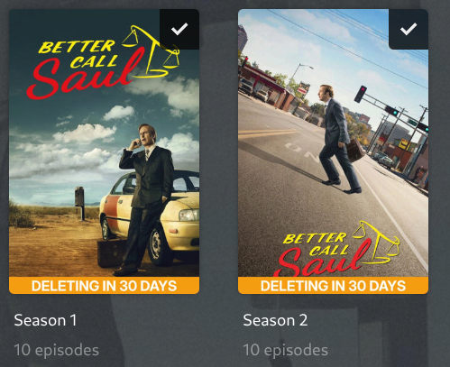

# Agregarr (bitr8 fork)

[](https://github.com/bitr8/agregarr-dev/releases/latest) [](https://hub.docker.com/r/bitr8/agregarr) [](LICENSE)

Active fork of [Agregarr](https://github.com/agregarr/agregarr) with performance fixes, placeholder lifecycle improvements, FlareSolverr support, and open upstream PRs bundled into a single Docker image. Available as `bitr8/agregarr` on Docker Hub.

> [!TIP]
>
> **Latest release: [v2.9.1](https://github.com/bitr8/agregarr-dev/releases/tag/v2.9.1).** Run more than one Cloudflare solver (FlareSolverr, Byparr, or both) with automatic failover, and a health check that flags a missing solver instead of letting Networks collections fail silently. Full [release notes](https://github.com/bitr8/agregarr-dev/releases).

## Docker

Available on Docker Hub as [`bitr8/agregarr`](https://hub.docker.com/r/bitr8/agregarr).

| Tag             | What it tracks                                             |
| --------------- | ---------------------------------------------------------- |
| `:latest`       | Stable releases. Recommended for most users.               |
| `:2.9.1` (etc.) | Pinned to a specific release.                              |
| `:develop`      | Bleeding edge. Builds on every push to develop, may break. |

**Multi-arch** release tags ship amd64 and arm64 (Apple Silicon, RPi 4+). The `:develop` tag builds amd64 only.

**Switching from upstream?** Replace the image line in your existing compose file. Config volumes are compatible.

```diff
-    image: agregarr/agregarr:latest
+    image: bitr8/agregarr:latest
```

### Compose example

```yaml
services:
  agregarr:
    image: bitr8/agregarr:latest
    container_name: agregarr
    volumes:
      - /path/to/config:/app/config
      - /path/to/placeholder/movies:/data/movies # Optional: Coming Soon
      - /path/to/placeholder/tv:/data/tv # Optional: Coming Soon
    environment:
      - TZ=Australia/Sydney
      - PUID=1000 # Your host user ID (run `id -u`)
      - PGID=1000 # Your host group ID (run `id -g`)
      - UMASK=022
    ports:
      - 7171:7171
    restart: unless-stopped
```

> [!WARNING]
>
> **File permissions:** Set `PUID` and `PGID` to match the user that owns your media directories. Without these, the container runs as root and creates directories with restrictive permissions that break imports in Sonarr, Radarr, and other apps. On Unraid, use `PUID=99` and `PGID=100`.

For general Agregarr configuration (services, collections, overlays etc.), see the [upstream docs](https://agregarr.org/docs/installation).

### Cloudflare solvers

FlixPatrol sits behind Cloudflare and blocks automated requests at the TLS layer. If you use FlixPatrol collections (Networks Top 10, streaming charts), you need a Cloudflare solver: FlareSolverr, [Byparr](https://github.com/ThePhaseless/Byparr), or both. The Docker image bundles headless Chromium as a fallback, but a dedicated solver is far more reliable.

```yaml
  flaresolverr:
    image: ghcr.io/flaresolverr/flaresolverr:latest
    container_name: flaresolverr
    environment:
      - LOG_LEVEL=info
    restart: unless-stopped
```

Add your instances under **Settings > Sources > Cloudflare Solvers** (e.g. `http://flaresolverr:8191`). You can run more than one: fetches try them in priority order, and a failing instance gets backed off per domain instead of blocking the rest.

## Relationship to upstream

This fork tracks upstream Agregarr and stays GPL-3.0. Changes that fit upstream go back as PRs (46 merged, 13 open). Fork-only features rely on behaviour or trade-offs upstream may not want to adopt.

## What's different

Detail for each feature is in the [release notes](https://github.com/bitr8/agregarr-dev/releases) for the version that shipped it.

### Collections

- **Ownership by label**: Agregarr only touches collections carrying its own label, so your own collections with matching names are left alone. ([v2.8.1](https://github.com/bitr8/agregarr-dev/releases/tag/v2.8.1))
- **Library essentials**: one config generates a smart collection per genre, decade, resolution, or content rating in a library. Include/exclude mode, auto-posters. ([v2.9.0](https://github.com/bitr8/agregarr-dev/releases/tag/v2.9.0))
- **Collection presets**: twelve starter configs (TMDB, IMDb, Trakt, Coming Soon, Netflix Top 10) that fill the form for you. ([v2.8.0](https://github.com/bitr8/agregarr-dev/releases/tag/v2.8.0))
- **Separators**: empty collections that carry a title card, breaking a long row into labelled groups. ([v2.8.0](https://github.com/bitr8/agregarr-dev/releases/tag/v2.8.0))
- **Per-user targeting**: restrict a collection to a single Plex user via label filtering. ([v2.8.0](https://github.com/bitr8/agregarr-dev/releases/tag/v2.8.0), cherry-pick from upstream [#555](https://github.com/agregarr/agregarr/pull/555))
- **Label collections**: build a collection from a Plex label. (Contributed by [Damienlee69](https://github.com/Damienlee69), [v2.9.0](https://github.com/bitr8/agregarr-dev/releases/tag/v2.9.0))
- **Export/import**: back up collection configs as JSON and restore them on the same or a different instance. ([v2.9.0](https://github.com/bitr8/agregarr-dev/releases/tag/v2.9.0))
- **Dynamic title prefix**: prepend your own text to rotating random/cycle collection titles. (Contributed by [gh0st-runner](https://github.com/gh0st-runner))
- **Last Episode Added sort** for smart collections.

### Overlays

- **Dashboard sync progress cards**: live progress, stats, ETA, start/stop for both collection and overlay syncs. 
- **Maintainerr season deletion countdown**: reads Maintainerr's collection data and draws the countdown on season posters using your templates. ([v2.7.0](https://github.com/bitr8/agregarr-dev/releases/tag/v2.7.0)) 
- **Episode media scanning**: aggregates actual episode files for resolution/HDR/DV badges instead of trusting show-level metadata. Per-library toggle. ([v2.5.0](https://github.com/bitr8/agregarr-dev/releases/tag/v2.5.0))
- **Next-episode countdowns** sourced from Sonarr (no gap when episodes air). ([v2.7.0](https://github.com/bitr8/agregarr-dev/releases/tag/v2.7.0))
- **Estimated release date flag**: templates can distinguish fabricated dates from published ones. ([v2.9.0](https://github.com/bitr8/agregarr-dev/releases/tag/v2.9.0))
- **Canvas size** configurable in the overlay editor (was locked to 1000x1500). ([v2.9.0](https://github.com/bitr8/agregarr-dev/releases/tag/v2.9.0))
- **Total seasons / seasons available** template variables. (Contributed by [Bergasha](https://github.com/Bergasha))

### Performance

Upstream makes individual API calls per item, per rating source, per cache miss. With 40+ collections and 10k+ items, syncs take hours. This fork batches IMDb prefetch, caches adaptively by content age, batches Plex metadata in groups of 200, caches TMDB resolution in SQLite, and uses plain HTTP for Letterboxd (280ms vs 10.5s per page). Syncs that took hours complete in minutes.

### Placeholders

Retroactive filter application, self-healing for stuck DB records, direct Plex deletion for stale items, TV episode cleanup, Sonarr folder naming, `.plexmatch` for movies, download status awareness, post-sync hub verification, and TV label cleanup. Detail in the release notes for [v2.3.0](https://github.com/bitr8/agregarr-dev/releases/tag/v2.3.0) through [v2.7.0](https://github.com/bitr8/agregarr-dev/releases/tag/v2.7.0).

### Health checks

Thirteen diagnostic checks run on a schedule and surface results in **Settings > Health**. Transient failures get a grace window, checks can be muted individually, and job runs are persisted with per-job detail. ([v2.9.0](https://github.com/bitr8/agregarr-dev/releases/tag/v2.9.0))

### Security

Session authentication on all settings routes, path containment on file operations, ZIP import limits, URL validation, download destination checks. ([v2.9.0](https://github.com/bitr8/agregarr-dev/releases/tag/v2.9.0))

## Upstream PRs

### Open

| PR                                                    | Description                                                 |
| ----------------------------------------------------- | ----------------------------------------------------------- |
| [#613](https://github.com/agregarr/agregarr/pull/613) | Don't dismiss modals when clicking portaled children        |
| [#607](https://github.com/agregarr/agregarr/pull/607) | Sort TMDB franchise parts by release date                   |
| [#606](https://github.com/agregarr/agregarr/pull/606) | Self-heal stale collectionRatingKey during label fallback   |
| [#605](https://github.com/agregarr/agregarr/pull/605) | Invalidate stale AWS WAF tokens and add solve backoff       |
| [#604](https://github.com/agregarr/agregarr/pull/604) | Quick sync exclusion bypass fix                             |
| [#599](https://github.com/agregarr/agregarr/pull/599) | Apply mutual exclusion to filtered hub collections          |
| [#596](https://github.com/agregarr/agregarr/pull/596) | Detect real content in TV placeholder cleanup via Plex      |
| [#595](https://github.com/agregarr/agregarr/pull/595) | Fix jobs page crash on unparseable cron expressions         |
| [#594](https://github.com/agregarr/agregarr/pull/594) | Sanitise poster filenames to match validation allowlist     |
| [#526](https://github.com/agregarr/agregarr/pull/526) | Retroactive placeholder filter evaluation during cleanup    |
| [#516](https://github.com/agregarr/agregarr/pull/516) | Check \*arr download status + Sonarr folder naming          |
| [#498](https://github.com/agregarr/agregarr/pull/498) | Deduplicate hub identifiers to prevent convergence failures |
| [#492](https://github.com/agregarr/agregarr/pull/492) | Title fallback for TV placeholders without TMDB GUID        |

[46 merged](https://github.com/agregarr/agregarr/pulls?q=is%3Apr+is%3Amerged+author%3Abitr8).

### Fork-Only (No Upstream PR Planned)

| Feature                                         | Why Fork-Only                               |
| ----------------------------------------------- | ------------------------------------------- |
| Direct Plex API deletion for stale placeholders | Requires "Allow media deletion" in Plex     |
| Post-sync hub verification for label leaks      | Safety net for fork's label-based filtering |

## License

GPL-3.0, same as upstream.

## Credits

Built on [Agregarr](https://github.com/agregarr/agregarr).
