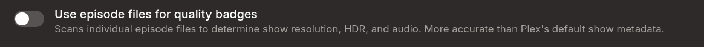

# Agregarr (bitr8 fork)

[](https://github.com/bitr8/agregarr-dev/releases/latest) [](https://hub.docker.com/r/bitr8/agregarr) [](LICENSE)

Active fork of [Agregarr](https://github.com/agregarr/agregarr) packaging performance fixes, placeholder lifecycle improvements, and open upstream PRs into a single Docker image. Available as `bitr8/agregarr` on Docker Hub.

> [!TIP]
>
> **Latest release: [v2.8.1](https://github.com/bitr8/agregarr-dev/releases/tag/v2.8.1).** Agregarr won't touch a collection unless it carries one of its own labels, so a collection of yours with a matching name gets left alone. Separator collections, a presets dropdown and per-user collection targeting landed in [v2.8.0](https://github.com/bitr8/agregarr-dev/releases/tag/v2.8.0) just before it. Full [release notes](https://github.com/bitr8/agregarr-dev/releases).

## Docker Image

Available on Docker Hub as [`bitr8/agregarr`](https://hub.docker.com/r/bitr8/agregarr).

| Tag             | What it tracks                                             |
| --------------- | ---------------------------------------------------------- |
| `:latest`       | Stable releases. Recommended for most users.               |
| `:2.8.1` (etc.) | Pinned to a specific release.                              |
| `:develop`      | Bleeding edge. Builds on every push to develop, may break. |

**Multi-arch** — release tags support amd64 and arm64 (Apple Silicon, Raspberry Pi 4+). The `:develop` tag builds amd64 only.

**Switching from upstream?** Replace the image line in your existing compose file. Config volumes are compatible.

```diff
-    image: agregarr/agregarr:latest
+    image: bitr8/agregarr:latest
```

### Compose example

```yaml
services:
  agregarr:
    image: bitr8/agregarr:latest
    container_name: agregarr
    volumes:
      - /path/to/config:/app/config
      - /path/to/placeholder/movies:/data/movies # Optional: Coming Soon
      - /path/to/placeholder/tv:/data/tv # Optional: Coming Soon
    environment:
      - TZ=Australia/Sydney
      - PUID=1000 # Your host user ID (run `id -u`)
      - PGID=1000 # Your host group ID (run `id -g`)
      - UMASK=022
    ports:
      - 7171:7171
    restart: unless-stopped
```

> [!WARNING]
>
> **File permissions:** You must set `PUID` and `PGID` to match the user that owns your media directories. Without these, the container runs as root and creates directories with restrictive permissions — which breaks imports in Sonarr, Radarr, and other apps that run as a non-root user. On Unraid, use `PUID=99` and `PGID=100`.

For general Agregarr configuration (services, collections, overlays etc.), see the [upstream docs](https://agregarr.org/docs/installation) — note that they reference the upstream image, not this fork.

## Relationship to upstream

This fork tracks upstream Agregarr and stays GPL-3.0. Changes that fit upstream go back as PRs (46 merged, 13 open). Fork-only features are documented separately — they rely on behaviour or trade-offs upstream may not want to adopt.

## Fork-Only Features

Two problem areas drove most of these changes: sync performance at scale (40+ collections, 10k+ items) and placeholder lifecycle gaps that leave orphaned entries in Plex. Early groundwork for Jellyfin support is underway.

### Dashboard Sync Progress Cards

Both collection and overlay syncs get unified side-by-side dashboard cards with live progress, stats, ETA, and start/stop controls. Cards are sticky -- they show last completed results when idle, and display "Waiting for..." when queued behind another job.


### Collections

**Ownership by Label** -- An `agregarr` label is the only thing that marks a collection as Agregarr's. When a config loses track of its collection in Plex it falls back to matching on title, and before 2.8.1 that fallback would adopt a collection of your own if the names matched: relabelled, contents replaced, smart filter overwritten. A config set to remove its collection when inactive could delete it. All five title-matching paths check the label now, so your own collection names don't have to stay distinct from your config names.

**Separator Collections** -- An empty collection that exists to carry a title card, so a long collection row can be broken into labelled groups instead of running together. Kometa has had these for years and they're a good idea. Separators skip the template engine, so the title renders exactly as you type it, and the form is cut down to visibility and time restrictions. Point one at your own poster template or take the built-in Separator template. _(fork [#41](https://github.com/bitr8/agregarr-dev/issues/41))_

**Collection Presets** -- Add Collection has a presets dropdown, twelve entries covering TMDB, IMDb, Trakt, Coming Soon and Netflix Top 10. Picking one fills in type, subtype, template, item limit and visibility, so a new collection is a name and a save rather than a form-filling exercise. Trakt presets stay hidden until Trakt credentials are saved. Coming Soon presets switch placeholder creation on for you. _(fork [#31](https://github.com/bitr8/agregarr-dev/issues/31), [#34](https://github.com/bitr8/agregarr-dev/issues/34))_

**Per-User Targeting** -- Any collection config can name a Target User. Agregarr labels the collection, excludes it from every other user's library filters, and shows a "Target User" badge in the listing. One limit worth knowing: Plex promotes a collection to the Home screen server-wide and there's no per-user version of that switch, so a targeted collection that's also home-promoted still shows on everyone's Home. Leave it recommended-only if you want it properly hidden. _(Cherry-picked from Elliott Carlson's upstream PR [#555](https://github.com/agregarr/agregarr/pull/555))_

**Library Essentials** -- One config creates a smart collection for every genre, decade, resolution or content rating in a library. Pick a subtype, pick a library, and the form discovers what values Plex already knows about -- a checkbox list lets you exclude the ones you don't want, or flip to include mode and hand-pick. Each collection is a Plex smart filter, so items sort themselves in as your library grows. Content ratings group by prefix (AU ratings, TV ratings, numeric ages, general) with per-group toggles.

Exclude mode means new values that appear in your library get a collection on the next sync. Include mode means only the values you picked. Separators and custom title templates work the same as directors/actors. Auto-poster defaults to off, hub visibility is locked off -- these are for browsing your library, not cluttering the home screen.

Smart collections also get a Last Episode Added sort option. _(fork [#43](https://github.com/bitr8/agregarr-dev/issues/43))_

**Label Collections** -- Pick a Plex label, get a collection of every item carrying it. Same pattern as Radarr/Sonarr Tag collections: items go through the standard filter, ordering, overlay, and generated poster pipeline. The label dropdown is populated from whichever library you select, and Preview works. _(Contributed by [Damienlee69](https://github.com/Damienlee69), fork [#48](https://github.com/bitr8/agregarr-dev/pull/48))_

### Performance

Upstream Agregarr makes individual API calls per item, per rating source, per cache miss. With 40+ collections and 10k+ items, syncs take hours and hammer external APIs. These changes reduce that to minutes.

| Fix                             | Why                                                   | Impact                                                     |
| ------------------------------- | ----------------------------------------------------- | ---------------------------------------------------------- |
| **Batch IMDb Prefetch**         | Upstream fetches IMDb ratings one item at a time      | Thousands of API calls reduced to tens                     |
| **Adaptive TTL Caching**        | All cached ratings expire at the same fixed interval  | New releases: 12h, older content: up to 30 days            |
| **Configurable Rating Cache**   | No way to tune cache duration                         | `ratingsCacheMaxDays` in settings.json (default: 30)       |
| **Collection Sync Cache**       | `getAllCollections()` called on every loop iteration  | Cached with mutation-based invalidation. Saves ~25-30s     |
| **Batch Overlay Metadata**      | Plex metadata fetched one item at a time              | Batches of 200 per API call. Falls back on failure         |
| **FlixPatrol CloudflareSolver** | Hardcoded browser-spoofing headers stopped working    | Playwright solver with FlareSolverr fallback, backoff      |
| **WAF Solver Timeout Fix**      | IMDb pages never reach `networkidle`, WAF solve hangs | Uses `/chart/top/` for token acquisition, `load` wait      |
| **AniList Retry Cap**           | `parseInt` NaN bug causes infinite tight retry loops  | Capped at 5 attempts                                       |
| **Release Date TTL Cap**        | Stale cache shows wrong overlay for new releases      | Items within 3 days of release: max 2h TTL                 |
| **Sync Status Fix**             | Large multi-source collections stuck as "pending"     | Self-heal for stale ratingKeys + item-level 404 resilience |
| **TMDB Random Graceful Fail**   | No random collection throws, blocks entire sync       | Warns and skips, existing collection preserved             |

**Persistent TMDB Resolution Cache** -- Letterboxd collections require resolving titles to TMDB IDs. Upstream re-resolves every item on every sync (6 TMDB API calls each). This caches results in SQLite with adaptive TTL.

| Metric          | First Sync (cold cache)     | Second Sync (warm cache) |
| --------------- | --------------------------- | ------------------------ |
| TMDB API calls  | ~33,000                     | 0                        |
| Resolution time | ~42 min                     | < 1 sec (all cache hits) |
| Cache entries   | 5,656 created (53 negative) | 5,656 served             |

**Plain HTTP for Letterboxd** (`letterboxdUsePlainHttp`) -- Upstream launches headless Chromium (Playwright) for every Letterboxd page fetch. This was added to bypass Cloudflare, but Letterboxd list pages return full HTML without JS rendering. Plain HTTP (axios) is sufficient.

|                   | Playwright | Plain HTTP |
| ----------------- | ---------- | ---------- |
| Per page          | ~10,500ms  | ~280ms     |
| 142 pages         | ~25 min    | ~40 sec    |
| Cloudflare blocks | 0          | 0          |

Enable via **Settings > Sources > Fetching Settings** in the UI. Defaults to on. Switch off if Cloudflare starts blocking.

**Plain HTTP for FlixPatrol** (`flixpatrolUsePlainHttp`) -- Same approach as Letterboxd. FlixPatrol top 10 pages return full HTML without Cloudflare challenges. Applies to all 3 fetch paths (platform top 10, country list, platform discovery).

Enable via **Settings > Sources > Fetching Settings** in the UI. Defaults to off (Playwright) for safety.

**FlareSolverr Support** (`flareSolverrUrl`) -- When a Cloudflare challenge can't be resolved by the built-in Playwright solver, FlareSolverr takes over. Set the URL in **Settings > Sources > Fetching Settings** or `flareSolverrUrl` under `main` in settings.json. The built-in solver tries first; on failure it falls back to FlareSolverr if configured, with exponential backoff on consecutive failures. Leave blank to skip the fallback.

Useful for FlixPatrol collections, since FlixPatrol sits behind Cloudflare and plain HTTP won't work. Add FlareSolverr to your compose:

```yaml
  flaresolverr:
    image: ghcr.io/flaresolverr/flaresolverr:latest
    container_name: flaresolverr
    environment:
      - LOG_LEVEL=info
    restart: unless-stopped
```

Then set the URL to `http://flaresolverr:8191`.

### Placeholder Lifecycle Fixes

Upstream placeholder cleanup has gaps that leave orphaned entries in Plex and don't respond to filter changes.

**Retroactive Filter Application** -- Upstream filters only apply at creation time — adding filters later has no effect on existing placeholders. This fork evaluates existing placeholders against the current filter config during cleanup and removes those that no longer pass. Rating filters are skipped since unreleased content has no ratings.

**Self-Healing for Stuck Records** -- If a placeholder file is deleted externally (disk issue, manual cleanup), the DB record blocks re-creation. This fork detects missing files and clears the stale record so the next sync can recreate it. Only triggers on confirmed ENOENT, not transient filesystem errors.

**Direct Plex Deletion** -- Plex ignores empty directories during library scans, so `scanLibrary()` + `emptyTrash()` won't clean up stale entries after a placeholder file is removed. This fork deletes stale items directly via `DELETE /library/metadata/{ratingKey}`, matching by exact file path. Falls back to scan+trash when direct deletion can't find matches.

**TV Episode Cleanup** -- TV placeholders create an S00E00 episode that persists in Plex after the placeholder file and DB record are cleaned up. Upstream cleanup queries shows, not episodes, so TV paths never match. This fork pre-resolves episode ratingKeys before file deletion and navigates show > Season 00 > Episode 0 to delete stale episodes during config cleanup.

**Sonarr Folder Naming** -- Agregarr creates placeholders at `/tv/Show (2024)/` but Sonarr uses `/tv/Show (2024) [imdbid-tt1234567]/`. When real content arrives, Plex sees them as different shows, leaving orphaned entries. This fork extracts the folder name from Sonarr's series path. Falls back to standard naming if the show isn't in Sonarr.

**Movie `.plexmatch` Files** -- Movie placeholders relied on the `{tmdb-ID}` filename tag alone, which Plex's metadata agent only processes after the scan finishes. TV placeholders have written a `.plexmatch` file since 2.6.0, which Plex reads during the scan instead. Movies do the same now, so GUIDs get assigned sooner and fewer creations time out waiting. Cleanup removes `.plexmatch` alongside `.comingsoon`, so deleting a placeholder doesn't leave an orphan folder. _(fork [#45](https://github.com/bitr8/agregarr-dev/issues/45))_

**Download Status Awareness** -- Upstream doesn't check whether content has already been downloaded in Radarr/Sonarr. This fork queries \*arr download status in batch, skips placeholder creation for items already downloaded, and uses download status as a cleanup signal. Prevents unnecessary placeholders for content that's about to arrive.

**Post-Sync Hub Verification** -- After collection sync completes, queries each filtered hub and applies missing `trailer-placeholder` labels to any items that slipped through. A safety net that catches label leaks regardless of which pipeline stage failed to apply them.

**TV Placeholder Label Cleanup** -- Upstream only removes the `trailer-placeholder` label during full sync's discovery path. Quick sync (when real content arrives between full syncs) cleaned up files and DB records but left the label on the Plex show, hiding it from Recently Added. This fork centralises label removal into all cleanup paths and adds a `tvdbId` fallback from the DB when marker files lack it.

**TV Placeholder Real Content Detection** -- Upstream's TV placeholder discovery never checks whether real content has arrived — when a Plex item exists for a marker, it always keeps it as a placeholder. Movies have this detection, but TV skips it entirely. This fork adds the same Plex metadata check: if the show has Season 1+ alongside Season 00, cleanup triggers. Sonarr download status is a secondary signal. Also fixes a truthy-empty-array bug where `Metadata || Directory` picks an empty array over a populated one, and makes label removal best-effort so transient Plex errors don't block cleanup.

### Coming Soon Improvements

**Prefer \*arr Release Dates** -- Upstream's TMDB enrichment unconditionally overwrites Radarr/Sonarr release dates, even when the \*arr source has more accurate data for monitored content. This fork preserves \*arr dates and only backfills from TMDB when a field is missing (e.g., Radarr has `digitalRelease` but no `physicalRelease`, TMDB fills the gap). Scoped to \*arr-sourced items only -- Trakt, TMDB, and Letterboxd sources still get TMDB dates as before. Logs a warning when \*arr and TMDB dates diverge by more than a week, so stale Radarr entries are visible in the logs.

**Announced Movies Without Dates** -- Upstream silently drops Radarr movies that have no release date fields at all (common for early announcements with `status: announced`). These items never reach TMDB enrichment, so TMDB can't provide dates either. This fork lets them through to enrichment, where TMDB can fill in theatrical or digital dates. Items that are still dateless after enrichment are filtered out by the existing post-enrichment date window check.

**Root Folder Filtering** -- Coming Soon monitored settings now include optional root folder dropdowns, populated from Radarr/Sonarr. Movies filter by path prefix, TV shows by `rootFolderPath` equality. Useful when multiple libraries point to different root folders on the same \*arr instance.

### Episode Media Scanning

Plex's show-level metadata doesn't always reflect what's on disk -- a show with one 4K episode out of 99 can report as "4K", or a fully upgraded library can still show "1080p". This fork scans actual episode files and aggregates the results with majority vote.

Enable per library: **Overlays > library config > "Use episode files for quality badges"** (show libraries only).



| Aspect           | Before (Plex metadata)             | After (episode scanning)           |
| ---------------- | ---------------------------------- | ---------------------------------- |
| Resolution badge | Whatever Plex reports for the show | Majority of actual episode files   |
| HDR/DV badge     | Often wrong or missing             | True if 50%+ of episodes have it   |
| Audio codec      | Show-level guess                   | Most common across episodes        |
| Data source      | `episodeMediaSource: 'show'`       | `episodeMediaSource: 'aggregated'` |

**How it works:** Two-tier scan -- fetches the episode list (~19s for 21K episodes), then only batch-fetches stream detail (HDR, DV, bitDepth) if your templates use those fields (~133s). Results are cached in SQLite for 7 days with hash-based invalidation, so subsequent syncs complete in seconds.

Season 0 specials are excluded from aggregation (they're usually low-quality extras). Existing overlay templates benefit immediately -- aggregated values replace the primary context fields (`resolution`, `hdr`, `dolbyVision`, etc.). Raw show-level values are preserved as `showResolution`, `showHdr`, etc.

New template variables: `episodeCount`, `episode4kPercent`, `episodeHdrPercent`, `episodeDvPercent`, and all `show*` raw fields. Available in both variable text and application conditions.

### Next-Episode Countdowns

Sonarr is the authority for the next-episode date. TMDB's `next_episode_to_air` is served from a gateway cache and can lag reality by hours, so a countdown would drop off a poster once the episode aired and turn up again later when the cache caught up. Sonarr has the next episode lined up the second the current one airs, so there's no window left to fall through. TMDB still supplies identity and covers shows Sonarr doesn't track.

Two supporting changes make it stick. A failed fetch is told apart from a genuine "no upcoming episode", so a transient blip leaves the overlay alone instead of clearing it. And a countdown whose date has passed is cleared at read time, whatever a cache upstream believes. _(fork [#35](https://github.com/bitr8/agregarr-dev/issues/35))_

### Maintainerr Season Deletion Countdown

Maintainerr renders its own deletion overlays, seasons included, and does it well. But two tools writing and restoring the same Plex posters leaves neither one holding the truth about what the original looked like. If Agregarr manages your overlays you keep Maintainerr's rendering off, and season posters end up without a countdown.

So this fork reads Maintainerr's collection data and draws the countdown itself, using your own templates, the same way the existing movie and show countdown already works.


Enable per library: **Overlays > library config > "Season deletion countdown"** (show libraries only, greyed out until Maintainerr is connected).

What you need:

- Maintainerr 3.4.0 or newer. Older versions report the collection type as a number, so season collections get skipped and your movie/show countdowns carry on unchanged.
- A Maintainerr collection of type Season, with a deletion schedule.
- An overlay template that uses `daysUntilAction`, enabled for that library. The `Maintainerr Deleting Soon` preset works as-is.

Maintainerr's own overlay feature stays off. Agregarr reads `/api/collections/overlay-data` for the dates and renders the poster itself, so season posters match everything else in your library.

**Cleanup.** Agregarr saves each season's original poster before it overlays anything. Remove a season from the Maintainerr collection, switch the toggle off, or delete the library's overlay config entirely, and the original poster goes back and the `Overlay` label comes off. That last case is easy to get wrong: a library with no overlay config is normally never visited again, so it gets swept specifically to clean up seasons it still tracks.

If Maintainerr is unreachable, nothing happens at all. An empty response from a healthy Maintainerr means every season genuinely left the collection. An outage means we don't know, so the posters are left alone.

**Cost:** a Season-type collection makes Maintainerr rescan the whole library on every rule run (roughly 8 minutes on mine). That's Maintainerr's behaviour rather than anything this fork adds, but you should know before pointing one at a 20K-episode library.

**Nothing appeared?** Either the Maintainerr collection isn't type Season, or no `daysUntilAction` template is enabled for that library. Grep the logs for `MaintainerrSeasonOverlay`.

Season tiles in generated collection posters now carry an `S{n}` badge. Six tiles captioned "Season 1" through "Season 6" are impossible to tell apart at thumbnail size.

### Additional Overlay Variables

**TV Season Counts** -- Two new variables for TV show overlays: `totalSeasons` (from TMDB) and `seasonsAvailable` (seasons in your Plex library). Useful for overlays like "Season 2 of 5" or conditional overlays on incomplete shows. Available as both template variables and condition fields. _(Contributed by [Bergasha](https://github.com/Bergasha))_

## Upstream PRs

### Open

| PR                                                    | Description                                                 | Depends On |
| ----------------------------------------------------- | ----------------------------------------------------------- | ---------- |
| [#613](https://github.com/agregarr/agregarr/pull/613) | Don't dismiss modals when clicking portaled children        | -          |
| [#607](https://github.com/agregarr/agregarr/pull/607) | Sort TMDB franchise parts by release date                   | -          |
| [#606](https://github.com/agregarr/agregarr/pull/606) | Self-heal stale collectionRatingKey during label fallback   | -          |
| [#605](https://github.com/agregarr/agregarr/pull/605) | Invalidate stale AWS WAF tokens and add solve backoff       | -          |
| [#604](https://github.com/agregarr/agregarr/pull/604) | Quick sync exclusion bypass fix                             | -          |
| [#599](https://github.com/agregarr/agregarr/pull/599) | Apply mutual exclusion to filtered hub collections          | -          |
| [#596](https://github.com/agregarr/agregarr/pull/596) | Detect real content in TV placeholder cleanup via Plex      | -          |
| [#595](https://github.com/agregarr/agregarr/pull/595) | Fix jobs page crash on unparseable cron expressions         | -          |
| [#594](https://github.com/agregarr/agregarr/pull/594) | Sanitise poster filenames to match validation allowlist     | -          |
| [#526](https://github.com/agregarr/agregarr/pull/526) | Retroactive placeholder filter evaluation during cleanup    | -          |
| [#516](https://github.com/agregarr/agregarr/pull/516) | Check \*arr download status + Sonarr folder naming          | -          |
| [#498](https://github.com/agregarr/agregarr/pull/498) | Deduplicate hub identifiers to prevent convergence failures | -          |
| [#492](https://github.com/agregarr/agregarr/pull/492) | Title fallback for TV placeholders without TMDB GUID        | -          |

### Fork-Only (No Upstream PR Planned)

| Feature                                         | Why Fork-Only                               |
| ----------------------------------------------- | ------------------------------------------- |
| Direct Plex API deletion for stale placeholders | Requires "Allow media deletion" in Plex     |
| Post-sync hub verification for label leaks      | Safety net for fork's label-based filtering |

> **Note:** TV placeholders created before the Sonarr folder naming fix may not match Sonarr's naming convention. If orphaned placeholders appear after real content arrives, delete the placeholder folder and let the next sync recreate it correctly.

<details>
<summary>Merged (46 PRs)</summary>

| PR                                                    | Description                                                          |
| ----------------------------------------------------- | -------------------------------------------------------------------- |
| [#579](https://github.com/agregarr/agregarr/pull/579) | Refresh Plex shared-server cache at start of user filter batches     |
| [#578](https://github.com/agregarr/agregarr/pull/578) | Clean up legacy placeholder edition titles during sync               |
| [#567](https://github.com/agregarr/agregarr/pull/567) | Fix Plex webhook multer multipart parsing                            |
| [#556](https://github.com/agregarr/agregarr/pull/556) | Remove date-based overlays when content is downloaded                |
| [#547](https://github.com/agregarr/agregarr/pull/547) | Back off on IMDb Top 250 cache refresh failure                       |
| [#515](https://github.com/agregarr/agregarr/pull/515) | Remove vm2 sandbox dependency                                        |
| [#514](https://github.com/agregarr/agregarr/pull/514) | Fix SVG sanitisation bypass                                          |
| [#513](https://github.com/agregarr/agregarr/pull/513) | Fix export path traversal                                            |
| [#504](https://github.com/agregarr/agregarr/pull/504) | Support Maintainerr v3 API (mediaServerId rename)                    |
| [#503](https://github.com/agregarr/agregarr/pull/503) | Fix TV placeholders leaking into filtered hubs                       |
| [#491](https://github.com/agregarr/agregarr/pull/491) | Handle Plex returning TV seasons as Children.Directory               |
| [#481](https://github.com/agregarr/agregarr/pull/481) | Guard splice in arrangeCollectionItemsInOrder                        |
| [#483](https://github.com/agregarr/agregarr/pull/483) | Parallelise collection membership check in overlay test              |
| [#482](https://github.com/agregarr/agregarr/pull/482) | Index MAL IDs for constant-time lookups                              |
| [#467](https://github.com/agregarr/agregarr/pull/467) | Scan all placeholder-enabled libraries for discovery                 |
| [#459](https://github.com/agregarr/agregarr/pull/459) | Pass rating filters and seasonGrabOrder to multi-source collections  |
| [#456](https://github.com/agregarr/agregarr/pull/456) | Separate placeholder filters independent of auto-request filters     |
| [#454](https://github.com/agregarr/agregarr/pull/454) | Resolve Letterboxd items via film page TMDB links (#448)             |
| [#453](https://github.com/agregarr/agregarr/pull/453) | Re-apply placeholder markers during global discovery (#414)          |
| [#452](https://github.com/agregarr/agregarr/pull/452) | Disambiguate TMDB person search for person spotlight                 |
| [#450](https://github.com/agregarr/agregarr/pull/450) | Use episode air date for TV recently released filtered hubs          |
| [#446](https://github.com/agregarr/agregarr/pull/446) | Add date format options for US and UK/AU locales                     |
| [#445](https://github.com/agregarr/agregarr/pull/445) | Persist applyOverlaysDuringSync for pre-existing collections         |
| [#444](https://github.com/agregarr/agregarr/pull/444) | Use correct Plex API endpoint for collection title updates           |
| [#413](https://github.com/agregarr/agregarr/pull/413) | Pass options to ExternalAPI constructor correctly                    |
| [#405](https://github.com/agregarr/agregarr/pull/405) | Fix Letterboxd title extraction from data-item-name                  |
| [#400](https://github.com/agregarr/agregarr/pull/400) | Empty Plex trash after placeholder cleanup                           |
| [#387](https://github.com/agregarr/agregarr/pull/387) | Skip date filtering for non-Coming-Soon with includeAllReleasedItems |
| [#358](https://github.com/agregarr/agregarr/pull/358) | IMDb Top 250 English Movies collection type                          |
| [#356](https://github.com/agregarr/agregarr/pull/356) | Handle 404 gracefully when deleting hub items                        |
| [#350](https://github.com/agregarr/agregarr/pull/350) | Validate SVG icon dimensions and file type                           |
| [#349](https://github.com/agregarr/agregarr/pull/349) | Don't double-estimate digital release dates                          |
| [#348](https://github.com/agregarr/agregarr/pull/348) | Fix scheduler startNow immediate sync and deadlock bugs              |
| [#345](https://github.com/agregarr/agregarr/pull/345) | Multi-source label regex for collection matching                     |
| [#340](https://github.com/agregarr/agregarr/pull/340) | Handle Jellyfin trickplay directories during cleanup                 |
| [#332](https://github.com/agregarr/agregarr/pull/332) | Trigger Plex scan after placeholder cleanup                          |
| [#321](https://github.com/agregarr/agregarr/pull/321) | Surface per-collection sync errors to UI                             |
| [#306](https://github.com/agregarr/agregarr/pull/306) | Uniform scaling for non-standard poster aspect ratios                |
| [#305](https://github.com/agregarr/agregarr/pull/305) | Downgrade library mismatch message to debug level                    |
| [#304](https://github.com/agregarr/agregarr/pull/304) | Sync networksCountry to sources array on change                      |
| [#303](https://github.com/agregarr/agregarr/pull/303) | Fetch Maintainerr collections in overlay test route                  |
| [#302](https://github.com/agregarr/agregarr/pull/302) | Return episodeNumber from fetchReleaseDateInfo                       |
| [#300](https://github.com/agregarr/agregarr/pull/300) | Harden API clients and file operations                               |
| [#282](https://github.com/agregarr/agregarr/pull/282) | Sanitize error responses                                             |
| [#278](https://github.com/agregarr/agregarr/pull/278) | Filter daily shows from Coming Soon collections                      |
| [#277](https://github.com/agregarr/agregarr/pull/277) | TMDB poster caching and race condition fixes                         |

</details>

## Troubleshooting

The built-in health check panel (Settings > About) runs periodic checks and surfaces actionable warnings. Each check below links to guidance on what it means and how to resolve it.

### Connection: Plex
Plex is unreachable from the container. Check that the Plex IP/port in Settings > Plex is correct and that the Plex server is running.

### Connection: Sonarr
One or more Sonarr instances are unreachable. Check the hostname, port, and API key in Settings > Services for each instance named in the warning.

### Connection: Radarr
One or more Radarr instances are unreachable. Same as Sonarr — verify hostname, port, and API key.

### Connection: TMDB
TMDB API is unreachable. This usually means a network issue from the container. Check DNS and outbound connectivity.

### Connection: Ratings Proxy
The ratings proxy (api.agregarr.org) is unreachable. Ratings data may be stale. This is usually a transient outage.

### Connection: FlareSolverr
The configured FlareSolverr instance is unreachable. Sources that need Cloudflare solving (FlixPatrol, some Letterboxd pages) will fall back to the built-in browser. Check the URL in Settings > General.

### Collections Error State
One or more collection configs have sync errors. Open Settings > Collections and check the named configs. Common causes: source API down, invalid source URL, rate limiting.

### Orphaned Collection Keys
Collection configs point at Plex collections that no longer exist. This happens when a collection is deleted in Plex but the config still references it. Edit the affected configs in Settings > Collections and re-save to clear the stale reference.

### Plex Libraries
One or more configured library IDs no longer exist in Plex. This happens when a library is deleted in Plex. Remove the stale library from Settings > Collections and Settings > Overlays.

### Overlay Templates
An overlay library config references a template that no longer exists. Re-open Settings > Overlays for the named library and remove the stale entry.

### Data Directory
The config directory is not writable. Check your container volume mount and PUID/PGID settings.

### Timezone Configuration
The container timezone is UTC while Sonarr is configured. Air-date calculations may be off by one day. Set the `TZ` environment variable in your container config (e.g., `TZ=America/New_York`).

### Job Health
A scheduled sync job has failed or is overdue. Check Settings > Jobs for the named job. If it failed, the error message should indicate the cause. If overdue, the job scheduler may be stuck — restart the container.

## License

GPL-3.0, same as upstream.

## Credits

Built on [Agregarr](https://github.com/agregarr/agregarr).
