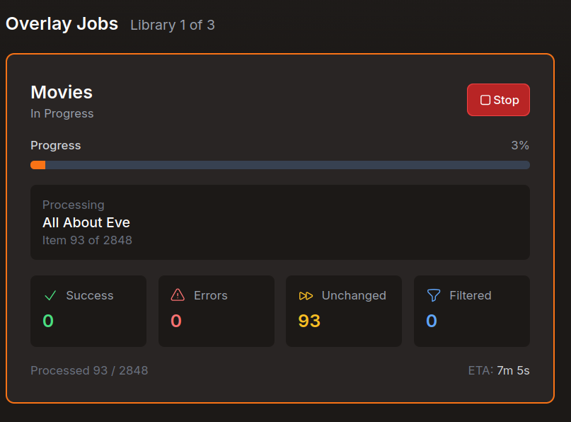

# Agregarr (Personal Fork)

Personal fork of [Agregarr](https://github.com/agregarr/agregarr) for testing changes before submitting upstream. Automatically builds to `bitr8/agregarr:develop` on Docker Hub.

## Docker Image

Available on Docker Hub as [`bitr8/agregarr`](https://hub.docker.com/r/bitr8/agregarr). Both `develop` and `latest` tags track the develop branch and include all fork-only features plus open upstream PRs. The image rebuilds automatically on every push to develop.

**amd64 only** — no arm64/Apple Silicon builds.

**Switching from upstream?** Replace the image line in your existing compose file — config volumes are compatible:

```diff
-    image: agregarr/agregarr:latest
+    image: bitr8/agregarr:develop
```

### Compose example

```yaml
services:
  agregarr:
    image: bitr8/agregarr:develop
    container_name: agregarr
    volumes:
      - /path/to/config:/app/config
      - /path/to/placeholder/movies:/data/movies # Optional: Coming Soon
      - /path/to/placeholder/tv:/data/tv # Optional: Coming Soon
    environment:
      - TZ=Australia/Sydney
    ports:
      - 7171:7171
    restart: unless-stopped
```

For general Agregarr configuration (services, collections, overlays etc.), see the [upstream docs](https://agregarr.org/docs/installation) — note that they reference the upstream image, not this fork.

## Fork-Only Features

Features not yet submitted upstream. These exist because upstream Agregarr has scaling pain points when running many collections, and placeholder lifecycle has gaps that leave orphaned entries in Plex.

### Real-time Overlay Job Progress

Overlay jobs on large libraries can run 30+ minutes with no feedback. This adds live dashboard status showing progress, item counts, ETA, and a stop button for each library.



### Performance

Upstream Agregarr makes individual API calls per item, per rating source, per cache miss. With 40+ collections and 10k+ items, syncs take hours and hammer external APIs. These changes reduce that to minutes.

| Fix                           | Why                                                  | Impact                                                 |
| ----------------------------- | ---------------------------------------------------- | ------------------------------------------------------ |
| **Batch IMDb Prefetch**       | Upstream fetches IMDb ratings one item at a time     | Thousands of API calls reduced to tens                 |
| **Adaptive TTL Caching**      | All cached ratings expire at the same fixed interval | New releases: 12h, older content: up to 30 days        |
| **Configurable Rating Cache** | No way to tune cache duration                        | `ratingsCacheMaxDays` in settings.json (default: 30)   |
| **Collection Sync Cache**     | `getAllCollections()` called on every loop iteration | Cached with mutation-based invalidation. Saves ~25-30s |
| **Batch Overlay Metadata**    | Plex metadata fetched one item at a time             | Batches of 200 per API call. Falls back on failure     |
| **AniList Retry Cap**         | `parseInt` NaN bug causes infinite tight retry loops | Capped at 5 attempts                                   |
| **Release Date TTL Cap**      | Stale cache shows wrong overlay for new releases     | Items within 3 days of release: max 2h TTL             |

**Persistent TMDB Resolution Cache** -- Letterboxd collections require resolving titles to TMDB IDs. Upstream re-resolves every item on every sync (6 TMDB API calls each). This caches results in SQLite with adaptive TTL.

| Metric          | First Sync (cold cache)     | Second Sync (warm cache) |
| --------------- | --------------------------- | ------------------------ |
| TMDB API calls  | ~33,000                     | 0                        |
| Resolution time | ~42 min                     | < 1 sec (all cache hits) |
| Cache entries   | 5,656 created (53 negative) | 5,656 served             |

**Plain HTTP for Letterboxd** (`letterboxdUsePlainHttp`) -- Upstream launches headless Chromium (Playwright) for every Letterboxd page fetch. This was added to bypass Cloudflare, but Letterboxd list pages return full HTML without JS rendering. Plain HTTP (axios) is sufficient.

|                   | Playwright | Plain HTTP |
| ----------------- | ---------- | ---------- |
| Per page          | ~10,500ms  | ~280ms     |
| 142 pages         | ~25 min    | ~40 sec    |
| Cloudflare blocks | 0          | 0          |

To enable, add to `settings.json`:

```json
{
  "main": {
    "letterboxdUsePlainHttp": true
  }
}
```

Defaults to `false` (Playwright) for safety. Flip back if Cloudflare starts blocking.

### Placeholder Lifecycle Fixes

Upstream placeholder cleanup has two gaps that leave orphaned entries in Plex.

**Direct Plex Deletion** -- Plex ignores empty directories during library scans. When a placeholder file is deleted and its folder becomes empty, `scanLibrary()` + `emptyTrash()` won't remove the stale database entry. This fork deletes stale items directly via `DELETE /library/metadata/{ratingKey}`, matching by exact file path. Falls back to scan+trash when direct deletion can't find matches.

**Sonarr Folder Naming** -- Agregarr creates placeholders at `/tv/Show (2024)/` but Sonarr uses `/tv/Show (2024) [imdbid-tt1234567]/`. When real content arrives, Plex sees them as different shows, leaving orphaned entries. This fork extracts the folder name from Sonarr's series path. Falls back to standard naming if the show isn't in Sonarr.

## Upstream PRs

### Open

| PR                                                    | Description                                                      | Depends On |
| ----------------------------------------------------- | ---------------------------------------------------------------- | ---------- |
| [#483](https://github.com/agregarr/agregarr/pull/483) | Parallelise collection membership check in overlay test          | -          |
| [#482](https://github.com/agregarr/agregarr/pull/482) | Index MAL IDs for constant-time lookups                          | -          |
| [#481](https://github.com/agregarr/agregarr/pull/481) | Guard splice in arrangeCollectionItemsInOrder                    | -          |
| [#404](https://github.com/agregarr/agregarr/pull/404) | Check \*arr download status for placeholder lifecycle            | -          |

### Pending Submission

| Feature                                         | Blocked By |
| ----------------------------------------------- | ---------- |
| Direct Plex API deletion for stale placeholders | -          |
| Use Sonarr folder naming for TV placeholders    | #404       |

> **Note:** Sonarr folder naming extends `batchCheckDownloadStatus()` from #404, adding `folderName` to the `showsByTvdbId` map. Cannot submit until #404 merges.

> **Legacy Cleanup:** TV placeholders created before the Sonarr folder naming fix may not match Sonarr's naming convention. If orphaned placeholders appear after real content arrives, delete the placeholder folder and let the next sync recreate it correctly.

### Merged

| PR                                                    | Description                                                          |
| ----------------------------------------------------- | -------------------------------------------------------------------- |
| [#467](https://github.com/agregarr/agregarr/pull/467) | Scan all placeholder-enabled libraries for discovery                 |
| [#459](https://github.com/agregarr/agregarr/pull/459) | Pass rating filters and seasonGrabOrder to multi-source collections  |
| [#456](https://github.com/agregarr/agregarr/pull/456) | Separate placeholder filters independent of auto-request filters     |
| [#454](https://github.com/agregarr/agregarr/pull/454) | Resolve Letterboxd items via film page TMDB links (#448)             |
| [#453](https://github.com/agregarr/agregarr/pull/453) | Re-apply placeholder markers during global discovery (#414)          |
| [#452](https://github.com/agregarr/agregarr/pull/452) | Disambiguate TMDB person search for person spotlight                 |
| [#450](https://github.com/agregarr/agregarr/pull/450) | Use episode air date for TV recently released filtered hubs          |
| [#446](https://github.com/agregarr/agregarr/pull/446) | Add date format options for US and UK/AU locales                     |
| [#445](https://github.com/agregarr/agregarr/pull/445) | Persist applyOverlaysDuringSync for pre-existing collections         |
| [#444](https://github.com/agregarr/agregarr/pull/444) | Use correct Plex API endpoint for collection title updates           |
| [#413](https://github.com/agregarr/agregarr/pull/413) | Pass options to ExternalAPI constructor correctly                    |
| [#405](https://github.com/agregarr/agregarr/pull/405) | Fix Letterboxd title extraction from data-item-name                  |
| [#400](https://github.com/agregarr/agregarr/pull/400) | Empty Plex trash after placeholder cleanup                           |
| [#387](https://github.com/agregarr/agregarr/pull/387) | Skip date filtering for non-Coming-Soon with includeAllReleasedItems |
| [#358](https://github.com/agregarr/agregarr/pull/358) | IMDb Top 250 English Movies collection type                          |
| [#356](https://github.com/agregarr/agregarr/pull/356) | Handle 404 gracefully when deleting hub items                        |
| [#350](https://github.com/agregarr/agregarr/pull/350) | Validate SVG icon dimensions and file type                           |
| [#349](https://github.com/agregarr/agregarr/pull/349) | Don't double-estimate digital release dates                          |
| [#348](https://github.com/agregarr/agregarr/pull/348) | Fix scheduler startNow immediate sync and deadlock bugs              |
| [#345](https://github.com/agregarr/agregarr/pull/345) | Multi-source label regex for collection matching                     |
| [#340](https://github.com/agregarr/agregarr/pull/340) | Handle Jellyfin trickplay directories during cleanup                 |
| [#332](https://github.com/agregarr/agregarr/pull/332) | Trigger Plex scan after placeholder cleanup                          |
| [#321](https://github.com/agregarr/agregarr/pull/321) | Surface per-collection sync errors to UI                             |
| [#306](https://github.com/agregarr/agregarr/pull/306) | Uniform scaling for non-standard poster aspect ratios                |
| [#305](https://github.com/agregarr/agregarr/pull/305) | Downgrade library mismatch message to debug level                    |
| [#304](https://github.com/agregarr/agregarr/pull/304) | Sync networksCountry to sources array on change                      |
| [#303](https://github.com/agregarr/agregarr/pull/303) | Fetch Maintainerr collections in overlay test route                  |
| [#302](https://github.com/agregarr/agregarr/pull/302) | Return episodeNumber from fetchReleaseDateInfo                       |
| [#300](https://github.com/agregarr/agregarr/pull/300) | Harden API clients and file operations                               |
| [#282](https://github.com/agregarr/agregarr/pull/282) | Sanitize error responses                                             |
| [#278](https://github.com/agregarr/agregarr/pull/278) | Filter daily shows from Coming Soon collections                      |
| [#277](https://github.com/agregarr/agregarr/pull/277) | TMDB poster caching and race condition fixes                         |

## License

GPL-3.0, same as upstream.

## Credits

All the real work is by the [Agregarr](https://github.com/agregarr/agregarr) team.
